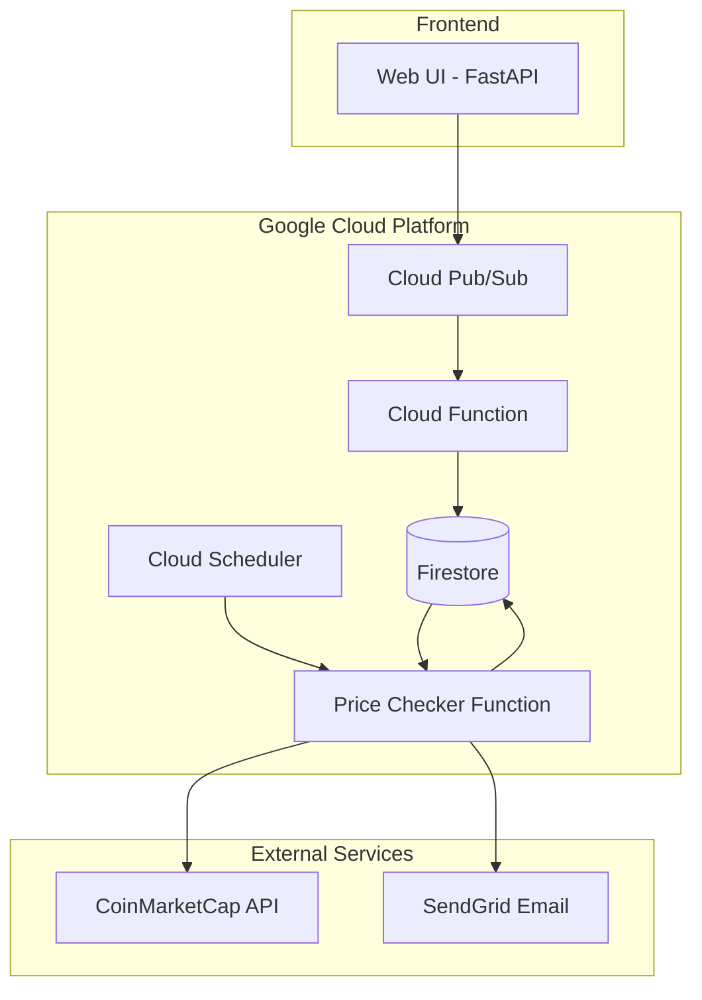

# Cryptocurrency Price Alert System

A cloud-based system that monitors cryptocurrency prices and sends email alerts when user-defined price conditions are met. Users can set price thresholds for various cryptocurrencies, and the system will notify them via email when those conditions are met.

## Team Members
- Pritam Chavan
- Mandar Deshmukh

## Architecture



The system consists of several components that work together:
- **Web Interface**: FastAPI-based frontend for creating alerts
- **Cloud Pub/Sub**: Handles message queuing for alerts
- **Cloud Functions**: Processes alerts and stores them in Firestore
- **Cloud Scheduler**: Triggers price checks at regular intervals
- **Price Checker**: Monitors cryptocurrency prices and sends notifications
- **Firestore**: Stores user alerts and system data
- **SendGrid**: Handles email notifications

## Frontend Technologies
- **FastAPI**: Used for creating RESTful endpoints and serving the web interface
- **Jinja2 Templates**: For server-side HTML rendering
- **Tailwind CSS**: For responsive and modern UI components
- **JavaScript/jQuery**: For interactive elements and form validation
- **Responsive Design**: Mobile-friendly interface that adapts to different screen sizes

## UI/UX Features
- **Intuitive Alert Creation**: Step-by-step form with real-time validation
- **Responsive Dashboard**: Adapts to desktop, tablet, and mobile viewports
- **Interactive Price Display**: Real-time updates when selecting cryptocurrencies
- **Toast Notifications**: User feedback for successful alert creation
- **Accessibility**: ARIA attributes and keyboard navigation support
- **Dark/Light Mode Toggle**: User preference-based theming

## Prerequisites
- Python 3.9 or higher
- Google Cloud Platform account
- SendGrid account with verified sender
- CoinMarketCap API key

## Setup Instructions

1. **Clone the Repository**
```bash
git clone <repository-url>
cd crypto-alert-system
```

2. **Set Up Virtual Environment**
```bash
python -m venv venv
source venv/bin/activate  # On Windows: venv\Scripts\activate
pip install -r requirements.txt
```

3. **Configure Environment Variables**
Create a `.env.yaml` file with:
```yaml
SENDGRID_API_KEY: 'your-sendgrid-api-key'
```

4. **Deploy Cloud Functions**
```bash
# Deploy alert processing function
cd cloud-function
gcloud functions deploy process_alert \
--runtime=python39 \
--trigger-topic=crypto-price-updates \
--entry-point=process_alert \
--region=us-central1 \
--service-account=crypto-alert-sa@your-project-id.iam.gserviceaccount.com

# Deploy price checker function
cd ../price-checker
gcloud functions deploy check_crypto_prices \
--runtime=python39 \
--trigger-http \
--entry-point=check_crypto_prices \
--region=us-central1 \
--service-account=crypto-alert-sa@your-project-id.iam.gserviceaccount.com \
--allow-unauthenticated \
--env-vars-file=.env.yaml
```

5. **Start the FastAPI Server**
```bash
cd ..
uvicorn main:app --reload
```

## Project Structure
```
crypto-alert-system/
├── static/                  # Static files (CSS)
│   └── styles.css          # Custom styling for web interface
├── templates/              # HTML templates
│   ├── base.html          # Base template with common elements
│   └── create_alert.html  # Alert creation form template
├── cloud-function/         # Alert processing function
│   └── main.py            # Handles alert storage in Firestore
├── price-checker/          # Price monitoring function
│   └── main.py            # Checks prices and sends notifications
├── main.py                # FastAPI application
└── requirements.txt       # Project dependencies
```

## Frontend Implementation Highlights

### Interactive Form Validation
```javascript
// Form validation with immediate feedback
$('#alert-form').on('submit', function(e) {
  const price = parseFloat($('#target-price').val());
  if (isNaN(price) || price <= 0) {
    showError('Please enter a valid price');
    e.preventDefault();
    return false;
  }
  // Additional validation...
});
```

### Responsive Design Implementation
```css
/* Mobile-first approach with responsive breakpoints */
.alert-card {
  @apply w-full p-4 rounded-lg shadow-md;
}

/* Tablet and above */
@media (min-width: 768px) {
  .alert-card {
    @apply w-1/2 mx-auto;
  }
}

/* Desktop */
@media (min-width: 1024px) {
  .alert-card {
    @apply w-1/3;
  }
}
```

## Web Performance Optimizations
- CSS and JS minification for production deployment
- Lazy loading of non-critical resources
- Client-side caching of static assets
- Server-side response compression
- Optimized API payload sizes

## Development Workflow
- **Version Control**: Git for code management and collaboration
- **CI/CD**: Automated testing and deployment via GitHub Actions
- **Code Quality**: ESLint and Prettier for consistent styling
- **Cross-browser Testing**: Verified on Chrome, Firefox, Safari, and Edge
- **Iterative Development**: Regular feature updates based on user feedback

## API Endpoints

- `GET /`: Web interface for creating alerts
- `POST /alerts`: Create new price alert
- `GET /cryptocurrencies`: List available cryptocurrencies (prioritizes BTC, ETH, USDT)
- `GET /prices/{crypto_id}`: Get current price for a cryptocurrency

## System Features

1. **Real-time Price Monitoring**
   - Monitors cryptocurrency prices using CoinMarketCap API
   - Supports multiple cryptocurrencies
   - Configurable check intervals via Cloud Scheduler
   - Prioritized display of major cryptocurrencies

2. **Alert Management**
   - Create price alerts with conditions (above/below)
   - Email notifications via SendGrid
   - Alert deactivation after triggering
   - User email verification and storage

3. **Web Interface**
   - User-friendly dashboard for creating alerts
   - Real-time price display
   - Interactive form with validation
   - Success/error notifications

## Testing

1. **Create Test Alert**
```bash
curl -X POST http://localhost:8000/alerts \
-H "Content-Type: application/json" \
-d '{
    "user_id": "test123",
    "cryptocurrency_id": "1",
    "target_price": 45000.00,
    "condition_type": "above",
    "notification_type": "email",
    "email": "your-email@example.com"
}'
```

2. **Trigger Price Check**
```bash
curl -X POST "https://us-central1-your-project-id.cloudfunctions.net/check_crypto_prices"
```

3. **Verify Alert Storage**
- Check Firestore database for alert creation
- Verify user document creation
- Monitor Cloud Function logs

## Local Development Setup

1. **Setup Local Environment**
```bash
# Install dependencies
pip install -r requirements.txt

# Set environment variables
export SENDGRID_API_KEY='your-key'
export PROJECT_ID='your-project-id'
```

2. **Run Tests**
```bash
# Start local server
uvicorn main:app --reload

# Test alert creation
python -m pytest tests/
```
